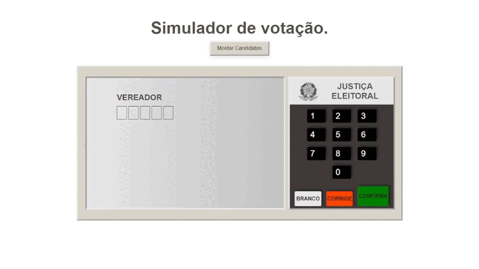

  

<h1 align="center">
 <a href="https://hailton-nascimento.github.io/UrnaEletrocina/" target="_blank" rel="noopener noreferrer">Demo</a>
</h1>

# Urna Eletrônica

Projeto desenvolvido para aprendizado de Html, Css, Javascript, foi proposto pelo perfil no youtube Bonieky Lacerda.

## Objetivo

- Fazer um  aplicação que fosse uma cópia funcional da Urna Eletrônica Brasileira, com Html, Css e JavaScript,  com todas funcionalidades.
- Com simulação de  Voto NULO, BRANCO, voto na Legenda, no vereador, prefeito com seu vice-prefeito.

Foram utilizadas as seguintes tecnologias:

<ul>
    <li>HTML</li>
    <li>CSS</li>
    <li>Javascript</li>
</ul>

### Contato

- Github - [Hailton Nascimento](https://github.com/Hailton-Nascimento)
- LinkedIn - [Hailton Nascimento](https://linkedin.com/in/hailton-nascimento)
